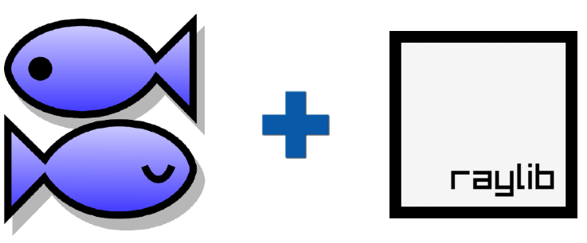

<header>
    

        <h1>Brute Engine</h1>
    

    <nav>
        <ul>
            <li><a href="#"> Whats the Brute Engine/System?</a></li>
            <li><a href="#"> Development Log</a></li>
            <li><a href="#"> Other Info </a></li>
            <li><a href="#"> Downloads </a></li>
        </ul>
    </nav>
</header>
<main>
    <section>
        <h2>KiriKiri Z + Raylib + KAG scripting</h2>
        

            This project occured to me when I was checking out an old rpg from Falcon called Dinosaur and its incredible story branching and implementation of game mechanics,
            but it was lacking something, and that is the ability to optimize the renderization of the map and many objects. What I'm trying to accomplish here is to make a 
            scalable version of many of those old but highly efficient storytelling systems. With Raylib I believe I can push it a step further by optimizing the renderization 
            process so that it's able to properly introduce 3D, 2D without too much stress on the system. KAG and Raylib should make this possible—of course, this will not be a copy-paste combination, 
            I will be attempting to optimize and make another version of the code for newer systems. And I will be using this blog to record some of my progress. Consider this a passion project which I will be working on in my spare time.
        

        

            
        

    </section>
    <section id="Oservices">
        <h2>Other Services</h2>
        <ol>
            <li>Software Development</li>
            <li>UI Design</li>
            <li>The adventure System Official Guide</li>
        </ol>
    </section>
    <section>
        <h2>Contact Information</h2>
        
Lorem, ipsum dolor sit amet consectetur adipisicing elit. Iure voluptatum aperiam modi harum ullam, ipsum numquam quas sed reprehenderit itaque. Modi laudantium dolorum assumenda reprehenderit aspernatur consequatur voluptatum, aut architecto?
        Vel enim tempore maiores dignissimos quos necessitatibus aliquid in ad! Facere nemo et quidem molestiae perferendis soluta voluptates, officia modi animi! Consequuntur illum facere rem, magni excepturi unde est culpa.

    </section>
</main>
<footer>
    Cetasoft 2025 S.A de C.V.
</footer>
